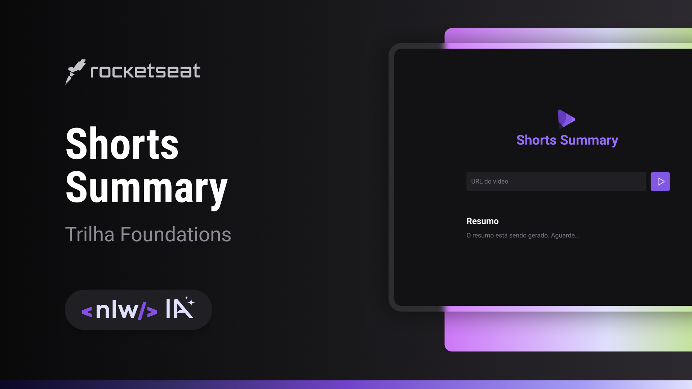

<h1 align="center"> Short Summary </h1>

Aplicação web para criar resumos de vídeos shorts do Youtube utilizando a Inteligência Artificial para transcrever o conteúdo do vídeo e realizar o resumo.  

  

  

 <h2 align="center"><a href="" target="_blank">Projeto ao vivo</a></h2>

### Projeto

Esse projeto foi desenvolvido na trilha Foundations da 13ª edição do Next Level Week, no NLW IA.

### :memo: Licença

Esse projeto está sob a licença MIT.

---

Feito com ♥ por Rocketseat :wave: [Participe da comunidade!](https://discord.gg/rocketseat)
